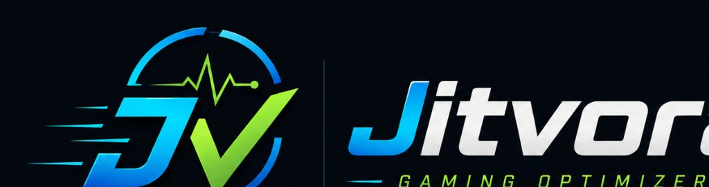

  

# Jitvora Gaming Optimizer

Free Windows gaming optimizer with cleaner, driver checks, Network Watch and safe system tools.

  
  
  
  
  

  <a href="https://github.com/LegendR622/Jitvora-Gaming-Optimizer/releases/latest"><strong>Download latest</strong></a>
  ·
  <a href="https://legendr622.github.io/Jitvora-Gaming-Optimizer/">Website</a>
  ·
  <a href="https://legendr622.github.io/Jitvora-Gaming-Optimizer/trust.html">Trust &amp; SHA256</a>
  ·
  <a href="CHANGELOG.md">Changelog</a>
  ·
  <a href="https://github.com/LegendR622/Jitvora-Gaming-Optimizer/releases">Releases</a>

---

## Overview

Jitvora Gaming Optimizer is a Windows desktop utility for gamers. It helps clean temporary files, review drivers, check network status with Network Watch and access safe Windows-focused optimization tools from one app.

> **Note:** This repository hosts public releases, version metadata and the GitHub Pages website. The app source is currently built locally and is not published here.

---

## Highlights

- Jitvora **v2.0.0** public release
- Premium website and clean GitHub presentation
- Cleaner, driver check, repair tools and gaming settings
- Network Watch for network/server diagnostics where available
- Manual updates and SHA256 verification
- No game file modifications

---

## Features

| Feature       | What it does                                                          |
| ------------- | --------------------------------------------------------------------- |
| Gaming / FPS  | Game Mode, power plan and safe Windows settings for gaming.           |
| Cleaner       | Temporary file cleanup with preview.                                  |
| Driver check  | Hardware scan and official vendor download links.                     |
| Network Watch | Network diagnostics and server/connection visibility where available. |
| Security      | Basic Windows security overview.                                      |
| Repair        | Shortcuts for SFC, DISM and common Windows repair actions.            |
| Pro Center    | Advanced tools preview for future versions.                           |

Full version is **free**. Pro Center currently shows planned/preview tools; advanced Pro tools may be expanded in future versions.

---

## Download

Download Jitvora only from the official website or official GitHub Releases.

- **Latest release:** https://github.com/LegendR622/Jitvora-Gaming-Optimizer/releases/latest
- **Direct installer:** https://github.com/LegendR622/Jitvora-Gaming-Optimizer/releases/download/v2.0.0/Jitvora_Gaming_Optimizer_Setup_v2.0.0.exe
- **Website:** https://legendr622.github.io/Jitvora-Gaming-Optimizer/

**Installer:** `Jitvora_Gaming_Optimizer_Setup_v2.0.0.exe`

---

## Trust & safety

Jitvora focuses on Windows settings, diagnostics and safe utilities.  
It does not modify game files and does not use memory reading, injection, hooks or anti-cheat bypass methods.

- **Trust page:** https://legendr622.github.io/Jitvora-Gaming-Optimizer/trust.html
- **Trust manifest:** https://legendr622.github.io/Jitvora-Gaming-Optimizer/trust-latest.json
- **GitHub Releases:** https://github.com/LegendR622/Jitvora-Gaming-Optimizer/releases

**v2.0.0 installer is currently unsigned.** Verify the SHA256 from `trust-latest.json` before installing. Windows SmartScreen may show a warning.

---

## Network Watch

Network Watch shows network diagnostics and server visibility where available.  
Real game ping is only shown when a real source is available.  
UDP flow timing is diagnostic only and is not presented as real game ping.

---

## Install

1. Download the latest installer.
2. Run the installer.
3. Start **Jitvora Gaming Optimizer**.
4. Run as Administrator only for actions that require it, such as repair tools, DNS actions, driver/system tasks or deeper diagnostics.

---

## Support

Support: [jitvora.optimizer@gmx.com](mailto:jitvora.optimizer@gmx.com)

---

## License

© 2026 Tobias Immisch · Jitvora Gaming Optimizer

Do not redistribute modified installers without permission.
